 
 

 
 

 
 

 
 

<table>
<tr>
<td width="50%" valign="top" align="center">

Local-first Windows control center. Real telemetry, safe memory trimming, reviewed cleanup — no decorative dials.

<code>Tauri</code> <code>Rust</code> <code>React</code> <code>Vite</code>

</td>
<td width="50%" valign="top" align="center">

A BlueBuild recipe for a secure, developer-first Linux image. Atomic, signed, rebuilt nightly on Bazzite DX.

<code>BlueBuild</code> <code>Just</code> <code>Bazzite</code> <code>OCI</code>

</td>
</tr>
<tr>
<td width="50%" valign="top" align="center">

Chrome extension that strips Reddit back to the reading. Ads gone, layout yours, shortcuts throughout.

<code>MV3</code> <code>JavaScript</code> <code>CSS</code>

</td>
<td width="50%" valign="top" align="center">

DonutSMP-inspired prototype. Six games behind one dark, gold-accented design system.

<code>HTML</code> <code>CSS</code> <code>JavaScript</code>

</td>
</tr>
</table>

 

<!-- profile-ui.svg is generated from live contribution data by
     scripts/generate-contribution-graph.mjs, on the schedule in
     .github/workflows/contribution-graph.yml. Don't hand-edit it. -->

