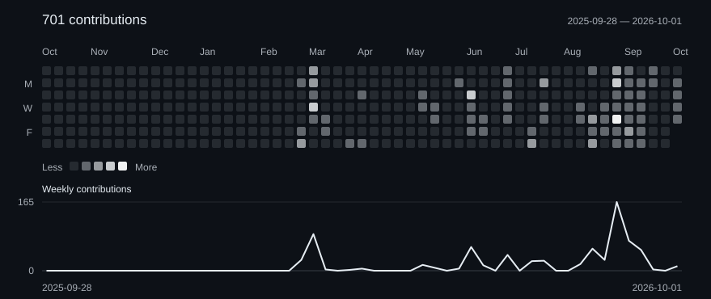

  
   
  <a href="./assets/nazuna-ascii.txt">View character source</a>

<h1 align="center">Fai1th</h1>

Web development and automation.

## About

I build web projects and automation tools with Python and JavaScript. My work includes React interfaces, personal assistants, and small tools for everyday workflows.

## Tools

  &nbsp;
  &nbsp;
  &nbsp;
  &nbsp;
  

## Connect

  
  &nbsp;&nbsp;
  

## Activity

