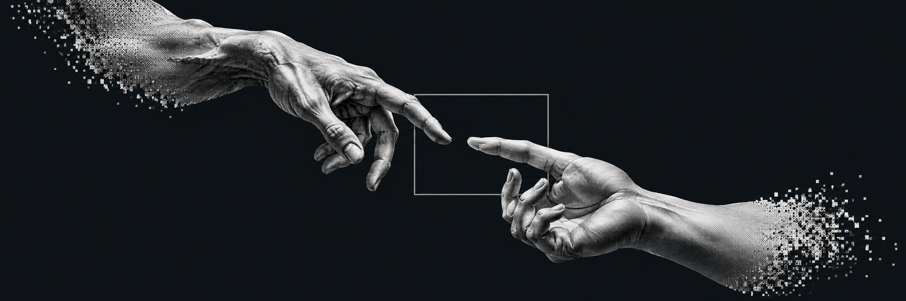

  

<h1 align="center">Hi, I'm Fai1th.</h1>

Web development &middot; Automation &middot; Personal projects

  <a href="https://fai1th.com">Website</a>
  &nbsp;&middot;&nbsp;
  <a href="https://open.spotify.com/user/31sbkq5o2viqrf5ilhq43lyg3teq">Spotify</a>

## About

I build web interfaces and automation tools with Python and JavaScript. I like making things I can use myself, from personal assistants to small apps that simplify everyday tasks.

I'm interested in how software feels to use: clear interfaces, thoughtful details, and less friction between an idea and a working tool.

## What I'm working on

- Web projects with React and TypeScript.
- Automation for repetitive tasks and personal workflows.
- Experiments with voice interfaces and personal assistants.

## Tools

**Languages:** Python, TypeScript, JavaScript

**Web:** React, Node.js
